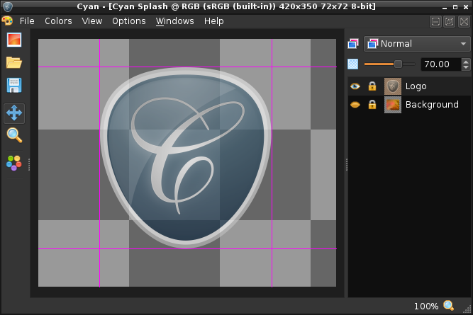

# Cyan 2.0

[](https://github.com/rodlie/cyan/blob/master/COPYING)




Cyan was an prepress color converter (and [GIMP](https://gimp.org) plug-in) but now aims to be a general-purpose image editor based on [ImageMagick](https://imagemagick.org).

***Currently under early development, not usable yet! please use [v1.2](https://github.com/rodlie/cyan/tree/1.2). You can track development on our [ChangeLog](https://cyan.fxarena.net/ChangeLog).***

## Features

* Simple and lightweight
* Multiple Document Interface
* Supports RGB/CMYK/GRAY 8/16/32 bit images
  * Depends on ImageMagick quantum depth
* Supports ICC/ICM v2/v4 color profiles
* Supports reading video frames through FFmpeg
* Supports PNG, JPEG, TIFF, EXR, XCF, PSD, MIFF and many more
  * Support for SVG and similar will be added in the future
* Supports TIFF, EXR, XCF, MIFF and PSD image layers
  * Support for Krita (KRA) and OpenRaster (ORA) will be added in the future
* Extract embedded ICC color profiles from images
* Embed ICC color profile to image(s)
* Edit ICC color profile tags
* Convert to and from RGB/CMYK/GRAY
* Over 40 different layer compositing modes

***Everything is subject to change during development of v2.***

## FAQ

...

## License

This program is free software; you can redistribute it and/or modify it under the terms of the GNU Lesser General Public License as published by the Free Software Foundation; either version 2.1 of the License, or (at your option) any later version.

* Color profiles are licensed under [CC Attribution-No Derivative Works 3.0](https://creativecommons.org/licenses/by-nd/3.0/)
* Icons are licensed under [CC Attribution 3.0 US](http://creativecommons.org/licenses/by/3.0/us/)
* Logo is licensed under [CC Attribution-ShareAlike 4.0 International](http://creativecommons.org/licenses/by-sa/4.0/)

## Build

### Requirements

 * Qt5 *(Widgets/Concurrent) 5.5+*
 * Little CMS 2
 * ImageMagick *(Magick++) 7.0.8+*
   * Minimum quantum depth of 16 is recommended
   * Zero configuration is recommended
   * HDRI required
   * lcms2 required
   * png/tiff/jpeg support as a minimum
 * fontconfig *(Windows/macOS)*
 * ffmpeg *3.x+ (optional)*

### RHEL/CentOS/Fedora

On RHEL/CentOS/Fedora you will need to install the following packages:

```
sudo yum install git gcc-c++ autoconf libpng-devel libjpeg-turbo-devel lcms2-devel OpenEXR-devel libwebp-devel pango-devel cairo-devel libtiff-devel xz-devel zlib-devel qt5-qtbase-devel cmake3
```

***Remember to replace ``cmake`` with ``cmake3`` on RHEL/CentOS when running the build command further down.***

### Ubuntu Xenial/Bionic

On Ubuntu you will need to install the following packages:

```
sudo apt-get install git build-essential cmake pkg-config qtbase5-dev libcairo2-dev libpango1.0-dev libwebp-dev liblcms2-dev libopenexr-dev libjpeg-dev libpng-dev libtiff-dev liblzma-dev zlib1g-dev libopenjp2-7-dev
```

* **Qt5 shipped with Ubuntu Bionic is buggy, not recommended!**

### Other distros

If your system has an up-to-date installation of ImageMagick v7 then you only need ``qtbase`` and  ``lcms2``.

### Build Cyan

Now you can build Cyan, this command will also build and link a static version of ImageMagick.
```
git clone https://github.com/rodlie/cyan
cd cyan
git submodule update --init
MKJOBS=4 STATIC=1 sh share/scripts/build-magick.sh
mkdir build && cd build
PKG_CONFIG_PATH=`pwd`/../ImageMagick/install/lib/pkgconfig cmake -DCMAKE_BUILD_TYPE=Release -DMAGICK_PKG_CONFIG=Magick++-7.Q16HDRI ..
make -j4
```

A more generic example:

```
cmake -DCMAKE_BUILD_TYPE=Release -DCMAKE_INSTALL_PREFIX=/usr -DMAGICK_PKG_CONFIG=Magick++-7.Q16HDRI <cyan_source_directory>
make -jX
sudo make install
```

## Packages

Packages for various Linux distributions are available on each commit.


### [CentOS 7](https://build.opensuse.org/package/binaries/home:rodlie:cyan-master/cyan/CentOS_7) *(x86_64)*

```
cd /etc/yum.repos.d/
sudo wget https://download.opensuse.org/repositories/home:rodlie:cyan-master/CentOS_7/home:rodlie:cyan-master.repo
sudo yum install cyan
```


### [Fedora 29](https://build.opensuse.org/package/binaries/home:rodlie:cyan-master/cyan/Fedora_29) *(x86_64, ppc64le, i686, armv7hl, aarch64)*

```
sudo dnf config-manager --add-repo https://download.opensuse.org/repositories/home:rodlie:cyan-master/Fedora_29/home:rodlie:cyan-master.repo
sudo dnf install cyan
```

### [Fedora 30](https://build.opensuse.org/package/binaries/home:rodlie:cyan-master/cyan/Fedora_30) *(x86_64, ppc64le, i686, armv7hl, aarch64)*

```
sudo dnf config-manager --add-repo https://download.opensuse.org/repositories/home:rodlie:cyan-master/Fedora_30/home:rodlie:cyan-master.repo
sudo dnf install cyan
```

### [Fedora RawHide](https://build.opensuse.org/package/binaries/home:rodlie:cyan-master/cyan/Fedora_Rawhide) *(x86_64)*

```
sudo dnf config-manager --add-repo https://download.opensuse.org/repositories/home:rodlie:cyan-master/Fedora_Rawhide/home:rodlie:cyan-master.repo
sudo dnf install cyan
```

